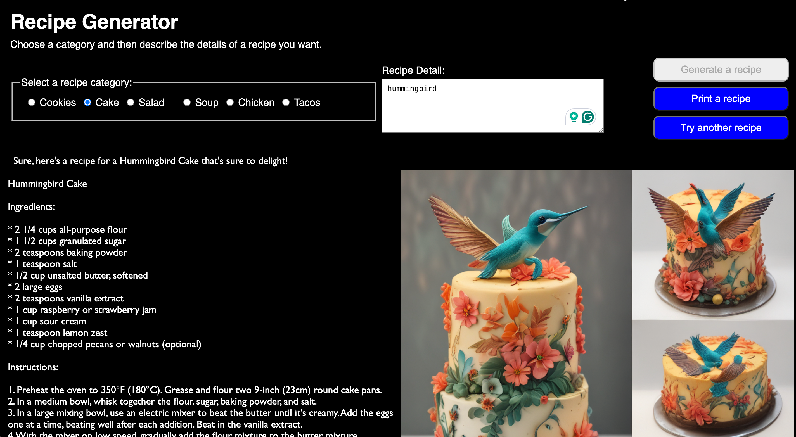

# Recipe Generator

This project is done dev.to [Cloudflare Challenge](https://dev.to/challenges/cloudflare)

## Problem
Looking up a recipe on the web can take a lot longer than you would link.  The ingredients and the instructions are often buried in a blog with a lot of ads popping up throughout.

In this application, using Cloudflare models for text and image generation, you can ask for a recipe based on a food category and a description.  The food category is used to enhance the prompt, instead of just allowing an open ended text input for the user to describe the recipe they are looking for.

The image along with the recipe is helpful as it's a visual cue that the food description has been interpretted correctly.

Buttons to print and try again will be enabled once the text and image of a recipe has been completed.

## Models Used

The Cloudflare models used are:
 - Chat:  @hf/thebloke/llama-2-13b-chat-awq
 - Image Generator: @cf/bytedance/stable-diffusion-xl-lightning

 ## Credit

 I learned a lot from reviewing one of the other entries: [Story and Image Generator](https://dev.to/bobbyiliev/my-cloudflare-ai-challenge-submission-story-and-image-generator-4fc3)
